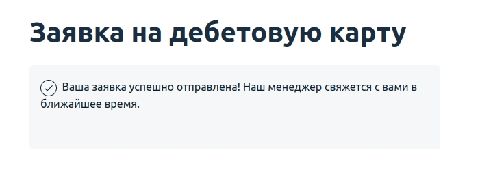

# Домашнее задание к занятию «2.1. Тестирование веб-интерфейсов»

## Задача №1: заказ карты

Вам необходимо автоматизировать тестирование формы заказа карты:

Требования к содержимому полей:
1. В поле фамилии и имени разрешены только русские буквы, дефисы и пробелы.
2. В поле телефона — только 11 цифр, символ + на первом месте.
3. Флажок согласия должен быть выставлен.

Тестируемая функциональность: отправка формы.

Условия: если все поля заполнены корректно, то вы получаете сообщение об успешно отправленной заявке:

Вам необходимо самостоятельно изучить элементы на странице, чтобы подобрать правильные селекторы.

    
Подсказка

    Смотрите на `data-test-id` и внутри него ищите нужный вам `input` — используйте вложенность для селекторов.

Проект с автотестами должен быть выполнен на базе Gradle с использованием Selenide или Selenium по выбору студента.

Для запуска тестируемого приложения необходимо запустить .jar файл командой:
`java -jar app-order.jar`.

Приложение будет запущено на порту 9999.

Если по каким-то причинам порт 9999 на вашей машине используется другим приложением, используйте:

`java -jar app-order.jar -port=7777`

Убедиться, что приложение работает, вы можете, открыв в браузере страницу: http://localhost:9999.
